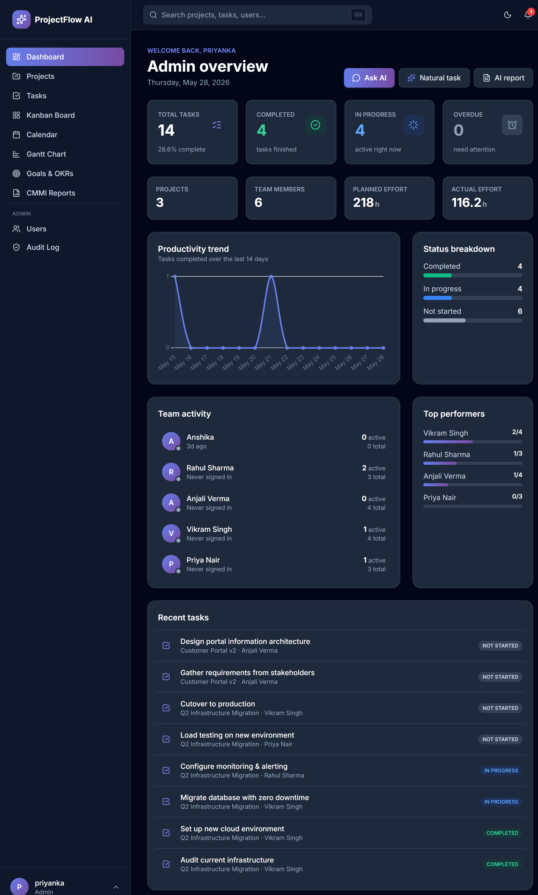
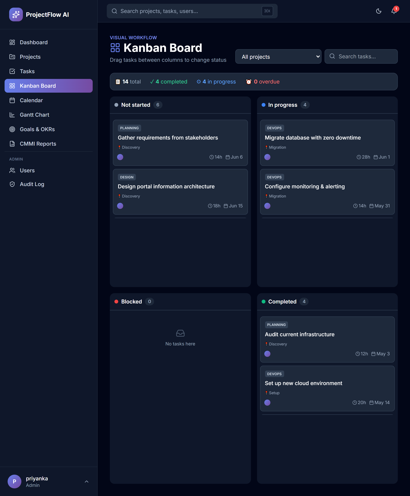
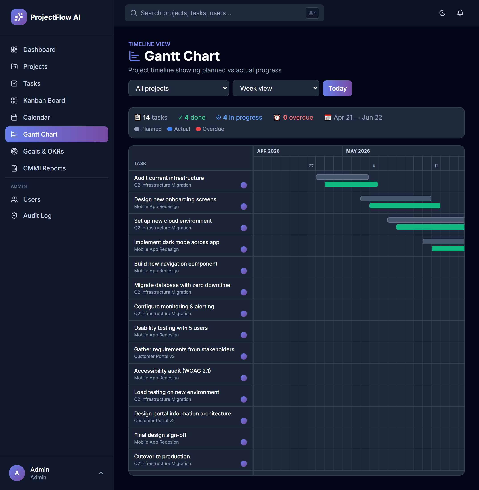
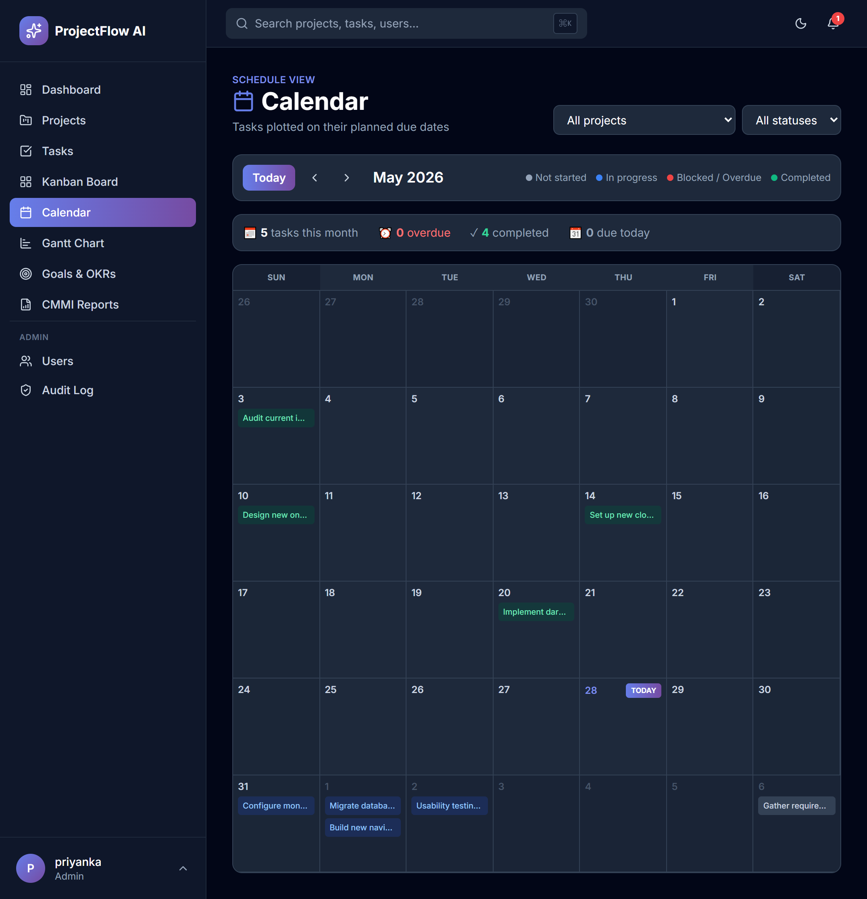
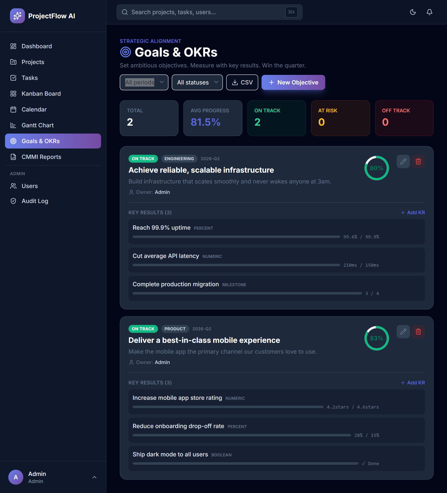
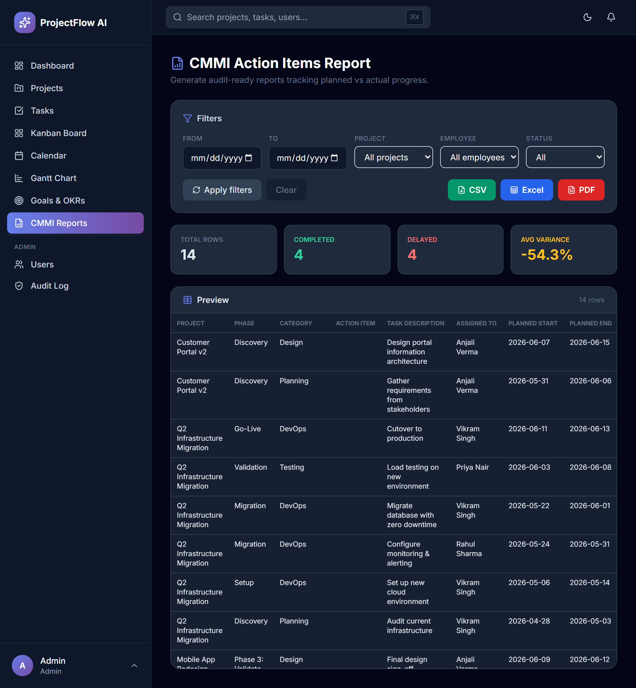
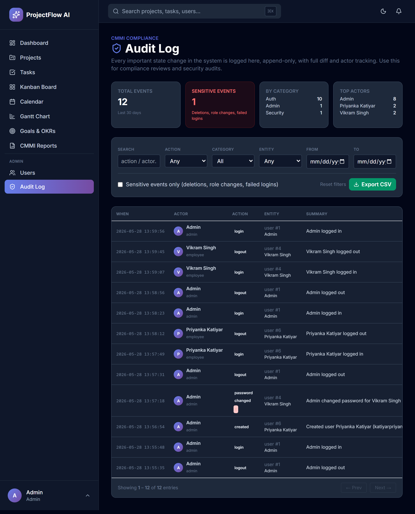

<div align="center">


# ProjectFlow AI

### CMMI-compliant project management with AI-powered insights, real-time collaboration, and installable PWA support

[](#-testing)
[](#-testing)
[](#-tech-stack)
[](#-tech-stack)
[](LICENSE)
[](https://projectflow-ai.onrender.com)

**[🌐 Live Demo](https://projectflow-ai.onrender.com)** • **[📸 Screenshots](#-screenshots)** • **[⚡ Quick Start](#-quick-start)** • **[🏗️ Architecture](#%EF%B8%8F-architecture)**

</div>

---

## Overview

**ProjectFlow AI** is a production-grade project management platform built for **CMMI-compliant software organizations**. it captures the specific artifacts CMMI Level 2–3 auditors require: planned-vs-actual schedules, append-only audit trails, role-segregated permissions, and traceable evidence collection.

It combines a modern PM tool (Kanban, Gantt, Calendar, OKRs) with **real AI integration** (Google Gemini), **WebSocket real-time updates**, and **PWA installability** — wrapped in a fully tested FastAPI codebase.

## Why I Built This

I originally started this project to explore how project management software could better support process-heavy teams. While tools like Jira and Asana handle task tracking well, I wanted to experiment with audit logging, planned-vs-actual tracking, and AI-assisted reporting in a single application.

The project also became a way to learn FastAPI, WebSockets, PWA development, and automated testing in a larger codebase.

### 🎬 Try the demo

  **Demo credentials:** `demo@projectflow.ai` / `demo1234`
  Live URL: https://projectflow-ai.onrender.com

---

## ✨ Key Features

### Four ways to view your work

| View | Purpose | Best for |
|------|---------|----------|
| **Dashboard** | Stats, charts, AI insights | Daily standup |
| **Tasks** | Filterable table | Bulk operations |
| **Kanban** | Drag-and-drop board | Workflow status |
| **Calendar** | Monthly grid | Deadline planning |
| **Gantt** | Timeline with planned vs actual bars | CMMI compliance |

### AI features (Google Gemini)

- **Ask AI** — chat with your data ("Who is overloaded?", "What's overdue?")
- **Natural task parser** — `"Fix login bug by Friday, high priority"` → structured fields
- **Auto reports** — generate weekly summaries and daily standups
- **Burnout detection** — flags employees with excessive workload
- **Deadline risk prediction** — assesses risk per task
- **Effort forecasting** — estimates hours from a description
- **Workload analysis** — detects imbalances across the team

###  CMMI Level 2–3 ready

- **Append-only audit log** — every change captured with before/after diffs
- **Role-based access control** — admin vs employee with field-level permissions
- **Sensitive event flagging** — role changes, deletions, failed logins marked
- **Planned vs actual tracking** — schedule baseline + variance reporting
- **CSV/Excel/PDF exports** — auditor-friendly artifacts
- **File attachments** — evidence collection on every task

###  Real-time & Modern

- **WebSocket push** — notifications arrive instantly (no polling)
- **PWA installable** — install on phone/desktop like a native app
- **Offline mode** — service worker caches pages for offline access
- **Dark mode** — every page, including auth flow
- **Email notifications** — SMTP with per-user preferences
- **Global search** — `Cmd+K` palette across projects/tasks/users/comments/OKRs

###  Goals & OKRs

- 4 Key Result types: numeric, percent, boolean, milestone
- Progress check-ins with history
- Visibility scopes: private, team, company
- CSV export

### 📎 Collaboration

- Threaded comments with @mentions
- File attachments (10MB cap, security-validated)
- Password reset with secure token flow
- Presence indicators (who's online now)

---

##  Screenshots


<table>
<tr>
<td width="50%" align="center">

### Dashboard

<em>AI-powered overview with productivity trends, team activity, and stat cards.</em>

</td>
<td width="50%" align="center">

### Kanban Board

<em>Drag-and-drop task management. Permissions enforced.</em>

</td>
</tr>
<tr>
<td width="50%" align="center">

### Gantt Chart

<em>Two-tier bars: planned (gray) vs actual (colored). TODAY marker, 3 zoom levels.</em>

</td>
<td width="50%" align="center">

### Calendar View

<em>Monthly grid. Click any day for the full list.</em>

</td>
</tr>
<tr>
<td width="50%" align="center">

### Goals & OKRs

<em>Objectives with 4 key-result types: numeric, percent, boolean, milestone.</em>

</td>
<td width="50%" align="center">

### CMMI Reports

<em>Audit-ready reports with planned-vs-actual variance. Export to CSV, Excel, PDF.</em>

</td>
</tr>
<tr>
<td width="50%" align="center">

### Audit Log

<em>Every action captured with before/after diffs. Sensitive events flagged.</em>

</td>
<td width="50%" align="center">

 
</td>
</tr>
</table>

---

##  Architecture

```
┌─────────────────────────────────────────────────────────────────┐
│                          Browser (Client)                       │
│  ┌──────────────────────────────────────────────────────────┐   │
│  │   Tailwind CSS + Alpine.js + Chart.js + Lucide Icons     │   │
│  │   ServiceWorker (PWA)  +  WebSocket client               │   │
│  └──────────────────────────────────────────────────────────┘   │
└────────────────┬───────────────────────────┬────────────────────┘
                 │ HTTP                      │ WebSocket (/ws)
                 ▼                           ▼
┌─────────────────────────────────────────────────────────────────┐
│                       FastAPI Application                       │
│  ┌────────────┐ ┌────────────┐ ┌────────────┐ ┌──────────────┐  │
│  │  Routes    │ │  Services  │ │   Models   │ │  WebSocket   │  │
│  │  (18 mods) │ │ (AI/Email/ │ │  (12 ORM   │ │  ConnMgr     │  │
│  │            │ │  Analytics)│ │   models)  │ │  singleton   │  │
│  └────────────┘ └────────────┘ └────────────┘ └──────────────┘  │
│         │             │              │              │           │
│         └─────────────┴──────────────┴──────────────┘           │
│                            │                                    │
│  ┌─────────────────────────▼─────────────────────────────────┐  │
│  │  Session Middleware │ Audit Logger │ Permission decorators│  │
│  └─────────────────────┬─────────────────────────────────────┘  │
└────────────────────────┼────────────────────────────────────────┘
                         │
        ┌────────────────┼────────────────┬──────────────┐
        ▼                ▼                ▼              ▼
   ┌─────────┐    ┌──────────────┐  ┌──────────┐  ┌────────────┐
   │ SQLite  │    │ Google Gemini│  │   SMTP   │  │  Disk FS   │
   │ (SQLA)  │    │     API      │  │  Server  │  │ (uploads/) │
   └─────────┘    └──────────────┘  └──────────┘  └────────────┘
```

### Design decisions

| Decision | Rationale |
|----------|-----------|
| **FastAPI over Django** | Async-native, OpenAPI auto-docs, modern Pydantic validation, smaller surface |
| **Jinja2 + Alpine.js over React** | Server-rendered → SEO + simpler deploy; Alpine = reactive UX without a build step |
| **SQLite default** | Zero-config local dev; designed for clean Postgres migration in production |
| **Session cookies over JWT** | Simpler revocation, no token-storage issues, works seamlessly with WebSocket auth |
| **Append-only audit** | CMMI requirement — log is tamper-proof, no `DELETE /api/audit/...` endpoint exists |
| **Per-route permission decorators** | Centralized, testable, prevents missing checks |
| **ConnectionManager singleton** | Tracks per-user WebSocket connections, supports multiple tabs per user |

---

## 🛠️ Tech Stack

**Backend**
- [FastAPI](https://fastapi.tiangolo.com/) 0.115 — async web framework
- [SQLAlchemy](https://www.sqlalchemy.org/) 2.0 — ORM with declarative models
- [Pydantic](https://docs.pydantic.dev/) 2.x — request/response validation
- [bcrypt](https://pypi.org/project/bcrypt/) — password hashing
- [Uvicorn](https://www.uvicorn.org/) — ASGI server with WebSocket support
- SQLite (dev) / PostgreSQL (production)

**Frontend**
- [Tailwind CSS](https://tailwindcss.com/) — utility-first styling
- [Alpine.js](https://alpinejs.dev/) — lightweight reactivity (~15KB)
- [Chart.js](https://www.chartjs.org/) — productivity / burndown charts
- [Lucide](https://lucide.dev/) — icon system
- Native HTML5 Drag-Drop API (no library)

**AI & integration**
- [Google Gemini](https://ai.google.dev/) (`gemini-flash-lite-latest`) — chat, parsing, reports
- SMTP — email notifications (Gmail / SendGrid / any SMTP)
- WebSocket (RFC 6455) — real-time push

**Testing**
- [pytest](https://docs.pytest.org/) 8.x — test runner
- [pytest-cov](https://pytest-cov.readthedocs.io/) — coverage reporting
- In-memory SQLite per test for isolation

**Deployment**
- [Render.com](https://render.com/) free tier (live demo)
- `Procfile` / `runtime.txt` work on any Python PaaS
- `.env`-driven configuration

---

##  Quick Start

### Prerequisites
- Python 3.12+
- pip

### Setup (3 minutes)

```bash
# 1. Clone
git clone https://github.com/<your-username>/projectflow-ai.git
cd projectflow-ai

# 2. Create virtual environment
python -m venv venv
source venv/bin/activate            # macOS/Linux
# venv\Scripts\activate             # Windows

# 3. Install dependencies
pip install -r requirements.txt

# 4. Configure (optional)
cp .env.example .env

# 5. Initialize database + create first admin
python -m app.setup

# 6. Run
uvicorn app.main:app --reload
```

Open **http://localhost:8000** and sign in with the admin credentials you just created.

### Optional environment variables (`.env`)

```bash
# AI features (free Gemini key: https://aistudio.google.com/apikey)
GEMINI_API_KEY=your-key-here

# Email (defaults to console output if blank)
SMTP_HOST=smtp.gmail.com
SMTP_PORT=587
SMTP_USER=your@gmail.com
SMTP_PASSWORD=your-app-password
SMTP_FROM=your@gmail.com
APP_BASE_URL=http://localhost:8000

# Sessions (generate with: python -c "import secrets; print(secrets.token_urlsafe(32))")
SECRET_KEY=generate-a-long-random-string
```

---
##  Testing

```bash
# Install dev dependencies
pip install -r requirements-dev.txt

# Run all tests (≈75 seconds)
pytest

# Run with coverage
pytest --cov=app --cov-report=html
open htmlcov/index.html

# Run a specific module
pytest tests/test_audit.py -v
```

**Test suite breakdown** (99 tests, 8 modules):

| Module | Tests | Focus |
|--------|------:|-------|
| `test_auth.py` | 9 | Login, logout, password hashing, session |
| `test_users.py` | 12 | CRUD + role-based permissions |
| `test_projects.py` | 16 | Project + ProjectTask + permission matrix |
| `test_notifications.py` | 8 | Creation, read state, admin notifications |
| `test_audit.py` | 14 | Append-only, filters, sensitive flagging |
| `test_attachments.py` | 13 | Upload, security, cascade delete |
| `test_search.py` | 7 | Cross-entity, permission-aware results |
| `test_okrs.py` | 11 | All 4 KR types, visibility rules |

Each test gets an **isolated in-memory SQLite database** via FastAPI dependency overrides — no flakiness, no cleanup between runs.

---

##  Security

- **Bcrypt password hashing** with proper salting
- **Session-based auth** with signed cookies (Starlette `SessionMiddleware`)
- **Permission decorators** enforced at every endpoint (admin vs employee vs assignee)
- **CSRF protection** via session signing
- **SQL injection–proof** — all queries via SQLAlchemy ORM, no raw SQL
- **XSS protection** — Jinja2 auto-escape; no `\| safe` filters on user content
- **File upload security** — UUID-based storage names, blocked dangerous extensions (`.exe`, `.bat`, `.sh`, …), 10MB size cap
- **Audit logging** of sensitive events (logins, role changes, deletions)
- **No secrets in repo** — `.env` is gitignored; example file provided

> For production: enable HTTPS-only cookies, set up reverse-proxy rate limiting, switch to PostgreSQL, rotate `SECRET_KEY`.

---

##  Project Structure
```
projectflow-ai/
├── app/
│   ├── main.py                 # FastAPI entry point
│   ├── config.py               # Pydantic settings from .env
│   ├── database.py             # SQLAlchemy engine + session
│   ├── setup.py                # First-time setup CLI
│   ├── migrate.py              # Database migrations
│   ├── models/                 # 12 SQLAlchemy models
│   │   ├── user.py
│   │   ├── project.py / project_task.py
│   │   ├── notification.py / comment.py
│   │   ├── attachment.py / audit_log.py
│   │   ├── objective.py / key_result.py
│   │   └── password_reset.py
│   ├── routes/                 # 18 route modules
│   │   ├── auth.py             # Login/logout
│   │   ├── users.py            # User CRUD
│   │   ├── projects.py         # Projects + tasks
│   │   ├── ai.py               # 8 AI endpoints
│   │   ├── attachments.py      # File uploads
│   │   ├── audit.py            # Audit log API
│   │   ├── okrs.py             # OKR system
│   │   ├── websocket.py        # Real-time layer
│   │   └── ...
│   └── services/
│       ├── ai_service.py       # Gemini wrapper + rule-based fallbacks
│       ├── analytics.py        # Dashboard stats / charts
│       ├── audit_service.py    # log_audit() + diff helpers
│       └── email_service.py    # SMTP with console fallback
├── templates/                  # 17 Jinja2 templates
│   ├── base.html               # Layout, sidebar, header, WS client
│   ├── dashboard.html / kanban.html / calendar.html / gantt.html
│   └── ...
├── static/
│   ├── manifest.json           # PWA manifest
│   ├── sw.js                   # Service worker
│   ├── offline.html            # Offline fallback
│   └── icons/                  # 9 PWA icon sizes
├── tests/                      # 99 pytest tests
│   ├── conftest.py             # Shared fixtures
│   └── test_*.py
├── data/                       # SQLite DB + uploaded files (gitignored)
├── requirements.txt
├── requirements-dev.txt
├── pytest.ini
├── Procfile / runtime.txt      # Deployment
└── .env.example
```

---

##  Deployment

### Render.com (free tier)

1. Push to GitHub
2. Create new Web Service → connect repo
3. Set environment variables (`SECRET_KEY`, `GEMINI_API_KEY`, `SMTP_*`)
4. Render auto-detects `Procfile` and `runtime.txt`

```procfile
# Procfile
web: uvicorn app.main:app --host 0.0.0.0 --port $PORT
```

```txt
# runtime.txt
python-3.12.7
```

The app self-initializes on first boot — visit `/setup` to create the first admin.

### Other platforms
Works on any Python PaaS: Railway, Fly.io, Heroku, AWS App Runner, Google Cloud Run, Azure App Service.

---

## 🎓 Engineering highlights

A few things in this codebase I'm particularly proud of:

- **CMMI requirements drove the architecture** — append-only audit log, planned-vs-actual schedule tracking, role segregation are not afterthoughts
- **WebSocket auth via session cookies** — cleaner than re-implementing JWT, integrates naturally with HTTP routes
- **Optimistic UI with rollback** — the Kanban board updates instantly on drag, snaps back if the API rejects the change
- **Service-worker scope handling** — `/sw.js` is served at root (not `/static/sw.js`) so it controls all pages
- **In-memory SQLite + dependency overrides** — fast, deterministic test isolation, no setup/teardown overhead
- **Permission tests are the highest-ROI tests** — every role × every endpoint, parametrized
- **Cascading deletes via SQLAlchemy `backref(cascade=...)`** — prevents orphan files on disk after task deletion
- **Connection-manager pattern for real-time** — supports multiple tabs/devices per user, broadcasts presence to all
- **Audit + email + WebSocket all decoupled** — each `notify()` call writes DB, sends email (if user opted in), and pushes WS event (if user online) without any one failing the others

---

##  Roadmap

- [ ] PostgreSQL migration scripts + connection pooling
- [ ] Redis caching layer for analytics
- [ ] Background task queue (Celery / RQ) for async emails
- [ ] Multi-tenant SaaS mode (org-scoped data)
- [ ] Sentry error tracking
- [ ] CI/CD pipeline (GitHub Actions: test + deploy on merge)
- [ ] Mobile-optimized hamburger nav
- [ ] Real-time collaborative Kanban
- [ ] Slack / Teams integration

---

##  Contributing

Pull requests welcome. For major changes, open an issue first.

```bash
# Development setup
pip install -r requirements-dev.txt
pytest                            # Run tests before opening PR
```

---

##  License

MIT — see [LICENSE](LICENSE).

---

##  Author

**Priyanka Katiyar**

- GitHub: https://github.com/priyankaKatiyar35
- LinkedIn: https://www.linkedin.com/in/priyanka-katiyar-493791229/
- Email: katiyarpriyanka35@gmail.com

If this project helped or impressed you, please ⭐ the repo — it helps a lot!

---

<div align="center">

**Built with 💜 and a lot of coffee.**

</div>
